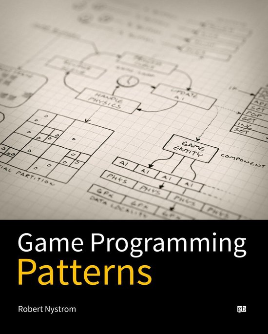

# VanaheimEngine
Named after the Homeland of the Vanir. 

## Description

  

This project came to life after having the Programming 4 course in my school. During that course we got familiar with engine design and programming patterns. But in that course we used OpenGL and SDL2 while I wanted to try and make a 3D engine with DirectX11.

The interest for using DirectX11 comes from the Graphics Programming course given by Matthieu Delaere. His explanation about various topics in this confusing but very interesting world of graphics programming gave me the idea to try and make my own 3D engine.

## Getting Started
Visual Studio 2022 is preferred.
1. Download the project
Get a copy of the project using your favorite git client.

2. How to use
2.1. Running **Debug** configuration
- Download & Install - Visual Leak Detector from 'https://kinddragon.github.io/vld/'
- Go into the folder '__ProjectScripts'
- Execute the '___ProjectGeneration___.bat' or '___ProjectGeneration_start___.bat' file. The second one automatically opens the project.
2.2. Running **Release** configuration
- Go into the folder '__ProjectScripts'
- Execute the '___ProjectGeneration___.bat' or '___ProjectGeneration_start___.bat' file. The second one automatically opens the project.

## Features
* DirectX11
* Keyboard & Controller input
* Noise Generation 
* Terrain Generation 
* OBJ parsing 
* Editor UI (IMGUI) 
* BMP Image Exporter

## Patterns: Game Programming Patterns (Book)

  

I am using this fantastic book through the entire development of the engine. This book helps understanding how to decouple a lot of aspects in a game or any other program that you make. 
The following patterns are used: 

* Command
* Observer
* Double buffer
* Game Loop
* Update Method
* Component
* Service Locator
* Dirty Flag

## Code snippets
[Entry point](https://github.com/SteveVerhoeven/VanaheimEngine/blob/master/DevGame/Main.cpp)

[Gameloop](https://github.com/SteveVerhoeven/VanaheimEngine/blob/master/VanaheimEngine/Game.cpp)

## Credits
### Creating entry point for the engine
[Chili](https://twitter.com/planetchili)

### Introduction to engine design
[Alex Vanden Abeele](https://www.linkedin.com/in/alexvandenabeele/)

[Tom Tesch](https://www.linkedin.com/in/tom-tesch-7999741/)

### DirectX11 knowledge before starting this project
[Matthieu Delaere](https://www.linkedin.com/in/matthieu-delaere/)

### Programming patterns 
[Game Programming Patterns](https://gameprogrammingpatterns.com/)
